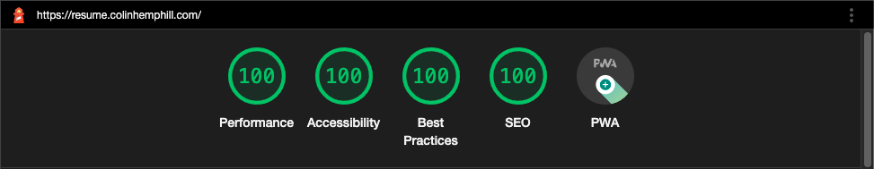
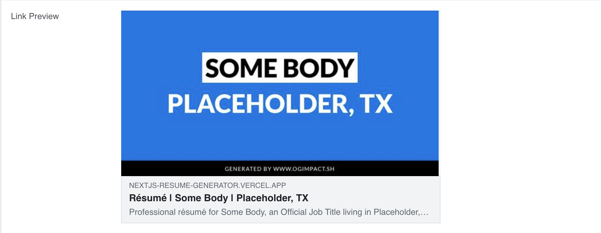

# Next.js Static Generated Résumé

This is a résumé built with Next.js, TypeScript, and Vanilla Extract, designed especially for software professionals. It aims to impress potential employers with a beautiful and incredibly fast résumé website, and can also generate a PDF for email and print.

[View Live Résumé](https://cv.heyanabelle.com)

This résumé can also generate a secure URL that displays private information (email, phone number, mailing address) not accessible on the public URL. This private link can be shared with potential employers or used to generate a more complete PDF.

## Technology

- [Next.js](https://nextjs.org)
- [TypeScript](https://www.typescriptlang.org/)
- [Vanilla Extract](https://vanilla-extract.style/)
- [Font Awesome 6](https://fontawesome.com/)
- [React-pdf](https://react-pdf.org/)
- [Marked](https://marked.js.org/)
- [Front Matter](https://frontmatter.codes/docs/markdown)
- [OG Impact](https://ogimpact.sh/)
- [Jest](https://jestjs.io/)
- [Testing Library](https://testing-library.com/)
- [Vercel](https://vercel.com/)

### It's FAST

This static generated site loads extremely quickly. The screenshot here is from an early Lighthouse test on the production deploy, using emulated mobile with "Slow 4G Throttling".



[View Lighthouse Report](docs/lighthouse-report.pdf)

## Content Management

The content for this résumé is managed via Markdown files with Front Matter within the `edit-me/cms/` directory. Each Markdown file uses Front Matter fields to add attributes to the item (like job title, dates, etc.). These attributes are type-safe, ensuring the project won't run if required fields are missing or invalid. The main body of the Markdown file is rendered as HTML to provide descriptions.

Detailed information on the CMS fields can be found in the [CMS setup document](README-CMS.md).

## Environment Variables

Regardless of where the app is deployed, it may need access to the following environment variables:

- `PRIVATE_KEY` (optional): this is a code, determined by the author, which will provide URL access to a version of the résumé that includes private information. We recommend generating this code (e.g. a UUID or using a password generator)

## Private Link

This project provides a secret URL that displays more information than the public URL. This is helpful for sharing a complete résumé with potential employers or generating a PDF for personal use, including details like email, phone number, and address.

### Setup

The private URL only works if a `PRIVATE_KEY` environment variable is set. If working locally, add this in a `.env.local` file:

```
PRIVATE_KEY=your-private-key
```

You can then visit `https://your-url.com/private/your-private-key` to see the private version of the résumé.

### Adding Private Content

For the built-in Markdown integration, please note that you **must be sure to not commit the private information to a public Git repo**. Only use this feature in a private repo, and even then _please be aware_ of the security concerns around commiting private information to any Git repo.

To add private data to the CMS, simply add it to the `privateFields` folder.

- `cms/privateFields/`. Add as many private contact information fields as you want to display. They will appear in the order they are arranged in the folder, so you can use a number prefix to order them.
  - `label`: **required string**. The label of the field, such as "Email" or "Address".

### Security

This private URL is _only as secure as the people you send it to_. To invalidate an old private URL, simply change the `PRIVATE_KEY` environment variable.

## Design

The résumé is built to be responsive, beautiful, and accessible. It supports automatic dark/light mode theming in the web version and provides a clean single-page print layout in the PDF version.

We use [OG Impact](https://ogimpact.sh/) to generate dynamic Open Graph (Facebook/Twitter) share images. By default, it will look something like this example from the Facebook Debugger:



This dynamic share image uses the configured `primaryColor` and data from the CMS.
